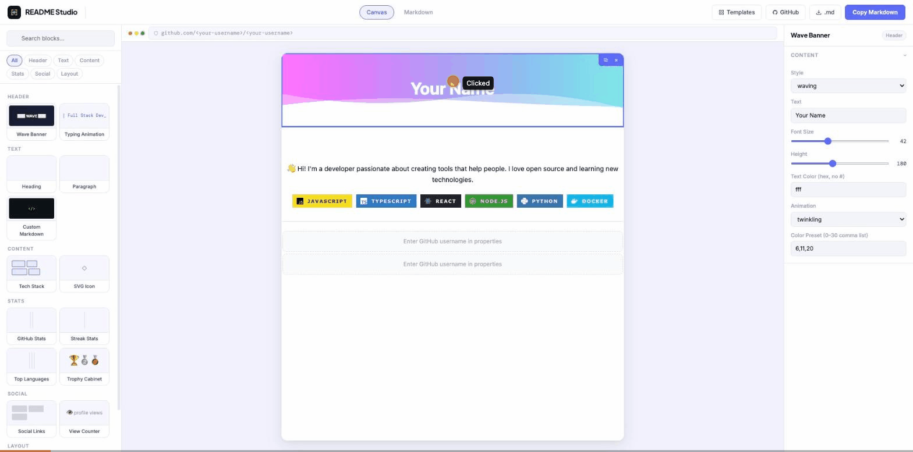
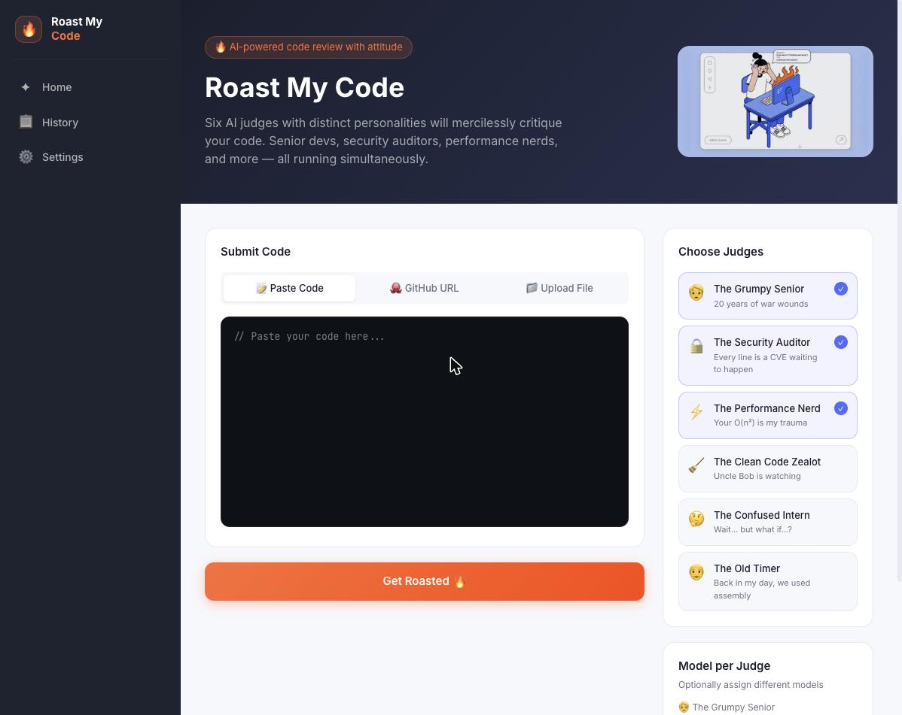
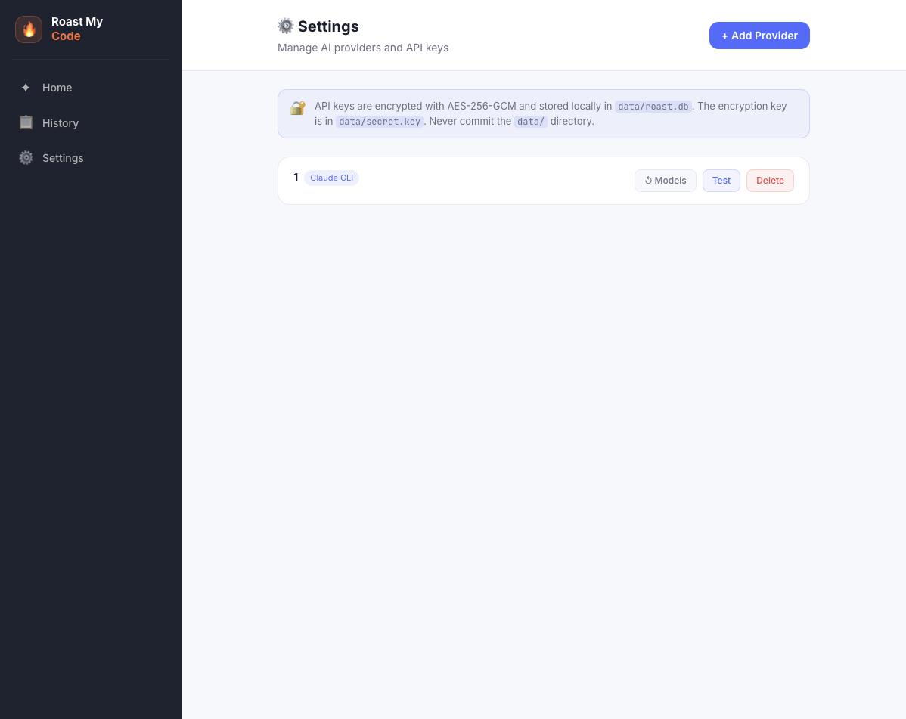

<div align="center">


# Roast My Code

### AI-powered code review with attitude

Six AI judges with distinct personalities will mercilessly critique your code —<br/>
Senior devs, security auditors, performance nerds, and more — all running **simultaneously**.

<p>
  
  
  
  
</p>



<p><a href="#-quick-start">Get started →</a></p>

</div>

---

## How it works

**1. Submit your code** — paste it, drop in a GitHub URL, or upload a file / `.zip` archive

**2. Choose your judges** — pick one or all six personalities; assign each a different AI model

**3. Get roasted** — results stream in live, in parallel, each judge finding different problems



---

## 🧑‍⚖️ Meet the Judges

| | Judge | Tagline | Focuses on |
|---|---|---|---|
| 🧓 | **The Grumpy Senior** | *20 years of war wounds* | Architecture, patterns, "I've seen this a thousand times" |
| 🔒 | **The Security Auditor** | *Every line is a CVE waiting to happen* | Injections, exposed secrets, auth bypasses, XSS |
| ⚡ | **The Performance Nerd** | *Your O(n²) is my trauma* | Algorithmic complexity, memory leaks, blocking calls |
| 🧹 | **The Clean Code Zealot** | *Uncle Bob is watching* | SOLID, naming, function length, code smells |
| 🤔 | **The Confused Intern** | *Wait… but what if…?* | Edge cases, undocumented assumptions, missing validation |
| 👴 | **The Old Timer** | *Back in my day, we used assembly* | Over-engineering, unnecessary frameworks, nostalgia |

Each judge returns a **severity-tagged issue list** + an **overall score** (0–100) + a **memorable quote** in character.

---

## 📥 Input Sources

| Source | How |
|---|---|
| **Paste Code** | Drop any snippet into the editor |
| **GitHub URL** | Repo URL (`github.com/owner/repo`) or single-file URL — fetches up to 20 files |
| **File Upload** | Any source file — `.ts`, `.py`, `.go`, `.rs`, `.java`, `.cpp`, `.cs` and more |
| **ZIP Archive** | Upload a `.zip` and all code files inside are extracted and sent |

---

## 🤖 Supported Models

Connect any combination of providers — each judge can use a different model:

| Provider | Notes |
|---|---|
| **Anthropic** | Claude 3.5 Sonnet, Haiku, Opus |
| **OpenAI** | GPT-4o, GPT-4 Turbo, o1 |
| **Google Gemini** | Gemini 1.5 Pro, Flash |
| **OpenRouter** | 200+ models via one key |
| **Ollama** | Local models, no API key needed |
| **CLI bridge** | `claude`, `aider`, or any shell command |

API keys are encrypted with **AES-256-GCM** and stored locally in `data/roast.db`. Nothing leaves your machine.



---

## ⚡ Quick Start

```bash
git clone https://github.com/takemygunq/roast-my-code
cd roast-my-code
npm install
npm run dev
```

Open **http://localhost:3000**, go to **Settings → Add Provider**, add an API key, then paste some code and hit **Get Roasted 🔥**

---

## 🔒 Privacy

- Runs entirely on your machine — no cloud, no telemetry
- API keys are AES-256-GCM encrypted in `data/roast.db`
- The `data/` directory is gitignored — your keys never leave your machine
- Your code is sent **only** to the AI providers you configure

---

## Tech

```
app/
  page.tsx              home: paste / github / upload input + judge selector
  roast/[id]/page.tsx   live streaming results per judge
  settings/page.tsx     provider management
  history/page.tsx      past roasts
  api/roast/route.ts    POST creates roast · GET streams SSE
  api/providers/        CRUD + health-check + model fetch
  api/fetch-repo/       GitHub URL + ZIP archive handler
lib/
  roasters.ts           6 judge personalities + JSON schema
  providers/            multi-provider abstraction (Anthropic / OpenAI / Gemini / OpenRouter / Ollama / CLI)
  db/schema.ts          providers · roasts · roast_events tables
  crypto.ts             AES-256-GCM key encryption
```

| Dependency | Used for |
|---|---|
| `Next.js 15` | App Router, SSE streaming |
| `better-sqlite3` + `drizzle-orm` | Local database |
| `@anthropic-ai/sdk` / `openai` / `@google/genai` | Model adapters |
| `adm-zip` | ZIP archive extraction |
| `zod` | Response validation |

---

## License

MIT
